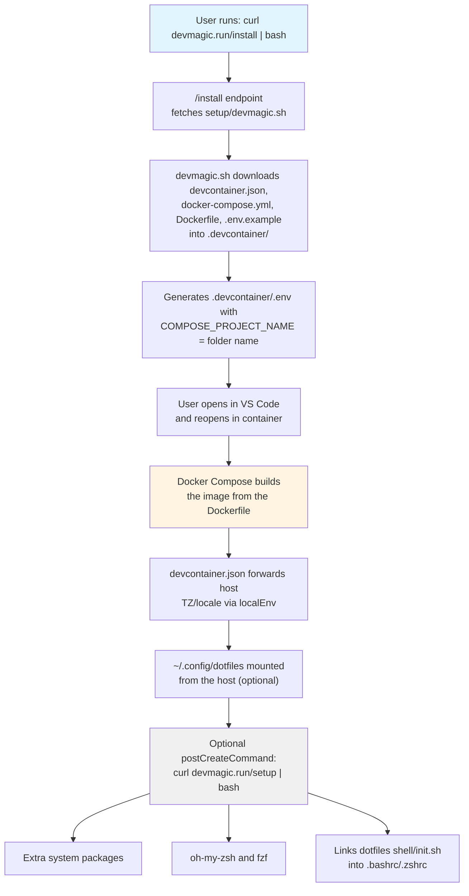

# DevMagic Architecture

This document describes the architecture, design decisions, and separation of concerns in DevMagic.

## Overview

DevMagic provides portable development environments using VS Code Dev Containers. The goal is to enable developers to go from "fresh OS" to "coding" in minutes with zero host installation (except container runtime + VS Code).

## Design Principles

1. **Zero friction** - Minimize steps from "fresh OS" to "coding"
2. **Consistency** - Same environment on every machine
3. **Modularity** - Start minimal, add services as needed
4. **Transparency** - Open source, well-documented, no magic
5. **Portability** - Works on Windows, Linux, macOS identically
6. **Separation of concerns** - Container infrastructure vs personal preferences

## Separation of Concerns

DevMagic deliberately separates **container infrastructure** from **personal environment preferences**:

```
Container Concerns (DevMagic)    ↔️   User Concerns (Dotfiles)
──────────────────────────────────────────────────────────────
.devcontainer/Dockerfile              dotfiles/shell/install.sh
├─ Base image (typescript-node)       ├─ Homebrew installation
└─ System packages (tmux, nvim, ...)  ├─ fzf, hugo, babashka
                                      ├─ Zsh plugins
.devcontainer/docker-compose.yml      ├─ VS Code settings symlinks
├─ Workspace + dotfiles mounts        └─ Shell configuration
├─ tmpfs /tmp, hostname, network
└─ Optional aux services (profiles)   dotfiles/shell/init.sh
                                      ├─ Runtime shell behavior
.devcontainer/devcontainer.json       ├─ PATHs, aliases, functions
├─ Features, extensions               └─ Sourced on every shell start
└─ Host env forwarding (localEnv)
```

### Why This Separation?

**DevMagic stays focused on container infrastructure:**

- Works for anyone using DevMagic
- No personal preferences baked in
- Minimal and maintainable

**Dotfiles handle personal environment:**

- Your settings follow you everywhere (not just containers)
- Editor-agnostic (VS Code, Neovim, Cursor, etc.)
- Full version control of your preferences
- Works on any machine, not just dev containers

### The Install Script Location

**Q: Should `install.sh` be in DevMagic or dotfiles?**

**A: It should stay in your dotfiles repo.**

The current design is correct:

- DevMagic = portable dev container infrastructure (works for anyone)
- Dotfiles = your personal preferences (only applies to you)

Dotfiles are **bind-mounted from the host** instead of cloned inside the container:

```yaml
# .devcontainer/docker-compose.yml (dev service)
volumes:
    - ..:/workspaces/${COMPOSE_PROJECT_NAME:-devmagic}
    - ${HOME}/.config/dotfiles:/home/node/.config/dotfiles
```

Optionally, the commented `postCreateCommand` in `devcontainer.json`
(`curl -fsSL https://devmagic.run/setup | bash`) installs extras (oh-my-zsh,
fzf) and links the mounted dotfiles' `shell/init.sh` into the container's
`.bashrc`/`.zshrc`.

This means:

- ✅ **Your machine**: One dotfiles folder shared by the host and every container, always in sync
- ✅ **Someone else using DevMagic**: Gets a working container (no dotfiles folder → Docker creates an empty one; nothing breaks)
- ✅ **No coupling**: DevMagic works without dotfiles; dotfiles are optional enhancement

## Installation Flow

<!-- IMPORTANT: Keep this flowchart synchronized with the Mermaid diagram below. -->

```
User runs: curl -fsSL https://devmagic.run/install | bash
    │
    ▼
/install endpoint → fetches setup/devmagic.sh from GitHub
    │
    ▼
devmagic.sh downloads ALL files into .devcontainer/ in the current dir:
  ├─ devcontainer.json
  ├─ docker-compose.yml
  ├─ Dockerfile
  ├─ .env.example
  └─ .env (generated: COMPOSE_PROJECT_NAME = project folder name)
    │
    ▼
User opens in VS Code and chooses "Reopen in Container"
    │
    ▼
Container starts:
  ├─ Docker Compose builds the image from the Dockerfile
  ├─ devcontainer.json forwards host TZ/locale via ${localEnv:*}
  ├─ ~/.config/dotfiles is mounted from the host (optional)
  └─ Optional postCreateCommand: curl -fsSL https://devmagic.run/setup | bash
        │
        ▼
    devcontainer-setup.sh (opt-in, commented out by default):
      ├─ Extra system packages (jq, ripgrep, fd, ...)
      ├─ oh-my-zsh and fzf
      └─ Links dotfiles' shell/init.sh into .bashrc/.zshrc
```

<details>
<summary><b>View as Mermaid diagram</b></summary>

<!-- IMPORTANT: Keep this flowchart synchronized with the diagram above. -->



</details>

## Homebrew vs Conda

For CLI tools like fzf, babashka, and hugo, **Homebrew is recommended** over Conda:

| Aspect               | Homebrew ✅                   | Conda                         |
| -------------------- | ----------------------------- | ----------------------------- |
| Purpose              | CLI tools and system packages | Python-centric ecosystem      |
| Package availability | Wide (fzf, babashka, hugo)    | Limited for non-Python tools  |
| Licensing            | Free and open                 | Commercial license concerns   |
| Conflicts            | N/A                           | Known conflicts with Homebrew |

## Custom Forks for Security

Security-critical tools are installed from custom forks for auditability:

- **fzf**: `marcelocra/fzf` → Fuzzy finder
- **zsh-autosuggestions**: `marcelocra/zsh-autosuggestions`
- **zsh-syntax-highlighting**: `marcelocra/zsh-syntax-highlighting`

This allows:

- Code review before updates
- Version pinning for stability
- No supply chain attacks from upstream

## VS Code Configuration Strategy

VS Code settings and keybindings are stored in the dotfiles repo and symlinked:

```
Dotfiles: ~/.config/dotfiles/apps/vscode/User/
├─ settings.json
└─ keybindings.json
        │
        ▼ (symlinked by install.sh)

Container: ~/.vscode-server/data/User/
├─ settings.json → ~/.config/dotfiles/apps/vscode/User/settings.json
└─ keybindings.json → ~/.config/dotfiles/apps/vscode/User/keybindings.json
```

The `install.sh` script detects the VS Code environment and symlinks accordingly:

- Remote container: `~/.vscode-server/data/User/`
- Native Linux: `~/.config/Code/User/`
- Native macOS: `~/Library/Application Support/Code/User/`

## Scripts Overview

### `setup/devmagic.sh`

- Entry point for `curl https://devmagic.run/install | bash`
- Downloads all `.devcontainer/` files (devcontainer.json, docker-compose.yml, Dockerfile, .env.example) to user's project
- Generates `.devcontainer/.env` with `COMPOSE_PROJECT_NAME` set to the project folder name

### `setup/devcontainer-setup.sh`

- Optional `postCreateCommand` (ships commented out in devcontainer.json)
- Installs extra packages, oh-my-zsh and fzf
- Links the mounted dotfiles' `shell/init.sh` into `.bashrc`/`.zshrc` if present

### `dotfiles/shell/install.sh` (in user's dotfiles repo)

- One-time setup for personal tools and preferences
- Installs Homebrew, CLI tools, zsh plugins
- Creates shell config symlinks
- Symlinks VS Code settings/keybindings
- Idempotent (safe to run multiple times)
- Environment-aware (detects container vs native)

### `dotfiles/shell/init.sh` (in user's dotfiles repo)

- Runtime shell configuration
- Sourced on every shell start (must be fast!)
- Sets up PATHs, aliases, functions
- No installation logic (that's in install.sh)

## Feature Flags

The dotfiles `install.sh` supports feature flags for customization:

```bash
# Skip specific components
DOTFILES_SKIP_HOMEBREW=true ./install.sh
DOTFILES_SKIP_CLI_TOOLS=true ./install.sh
DOTFILES_SKIP_ZSH_PLUGINS=true ./install.sh
DOTFILES_SKIP_VSCODE=true ./install.sh

# Enable debug logging
DOTFILES_DEBUG=1 ./install.sh
```

## File Organization

```
devmagic/
├── .devcontainer/           # The dev container setup (used by DevMagic itself
│   │                        # and downloaded into consumer projects)
│   ├── devcontainer.json   # Dev Container definition (Compose based)
│   ├── docker-compose.yml  # dev service + auxiliary services (profiles)
│   ├── Dockerfile          # Dev image (typescript-node + CLI tools)
│   ├── .env.example        # Documented template
│   └── .env                # COMPOSE_PROJECT_NAME (must match folder name)
├── setup/
│   ├── devmagic.sh         # Installation script (adds DevMagic to projects)
│   └── devcontainer-setup.sh # Optional container extras (opt-in postCreate)
├── www/                     # Website source (devmagic.run)
│   ├── app/
│   │   ├── install/route.ts # Serves devmagic.sh
│   │   └── setup/route.ts   # Serves devcontainer-setup.sh
│   └── ...
└── docs/                    # Documentation
    └── ARCHITECTURE.md     # This file

dotfiles/ (separate repo, mounted at ~/.config/dotfiles)
├── shell/
│   ├── init.sh             # Runtime configuration (sourced)
│   └── install.sh          # One-time setup (run once)
└── apps/
    └── vscode/
        └── User/
            ├── settings.json
            └── keybindings.json
```

## Related Documents

- [README.md](../README.md) - Getting started and usage
- [CONTRIBUTING.md](../CONTRIBUTING.md) - Development guidelines
- [CHANGELOG.md](../CHANGELOG.md) - Version history
