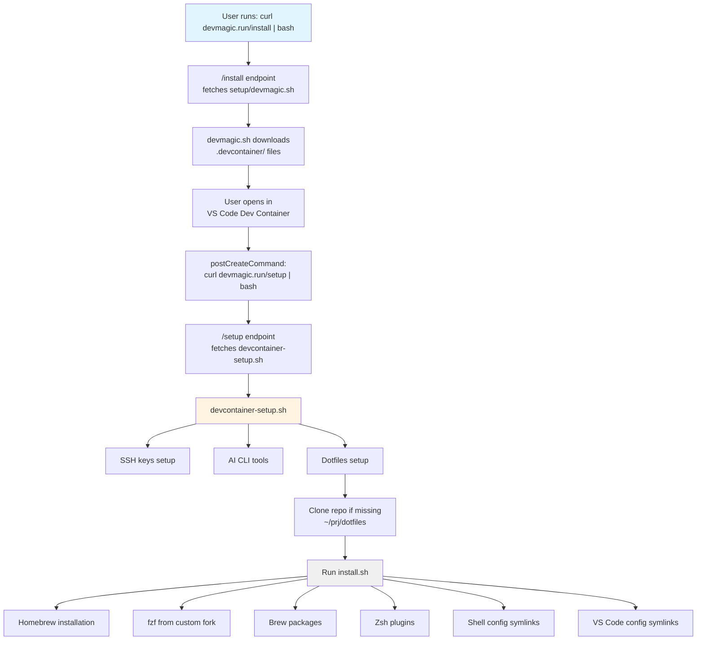

# DevMagic Architecture

This document describes the architecture, design decisions, and separation of concerns in DevMagic.

## Overview

DevMagic provides portable development environments using VS Code Dev Containers. The goal is to enable developers to go from "fresh OS" to "coding" in minutes with zero host installation (except container runtime + VS Code).

## Design Principles

1. **Zero friction** - Minimize steps from "fresh OS" to "coding"
2. **Consistency** - Same environment on every machine
3. **Modularity** - Start minimal, add services as needed
4. **Transparency** - Open source, well-documented, no magic
5. **Portability** - Works on Windows, Linux, macOS identically
6. **Separation of concerns** - Container infrastructure vs personal preferences

## Separation of Concerns

DevMagic deliberately separates **container infrastructure** from **personal environment preferences**:

```
Container Concerns (DevMagic)    ↔️   User Concerns (Dotfiles)
──────────────────────────────────────────────────────────────
devcontainer-setup.sh                 dotfiles/shell/install.sh
├─ SSH keys setup                     ├─ Homebrew installation
├─ AI CLI tools                       ├─ fzf, hugo, babashka
├─ Container-specific config          ├─ Zsh plugins
└─ Calls dotfiles/shell/install.sh    ├─ VS Code settings symlinks
                                      └─ Shell configuration

                                      dotfiles/shell/init.sh
                                      ├─ Runtime shell behavior
                                      ├─ PATHs, aliases, functions
                                      └─ Sourced on every shell start
```

### Why This Separation?

**DevMagic stays focused on container infrastructure:**

- Works for anyone using DevMagic
- No personal preferences baked in
- Minimal and maintainable

**Dotfiles handle personal environment:**

- Your settings follow you everywhere (not just containers)
- Editor-agnostic (VS Code, Neovim, Cursor, etc.)
- Full version control of your preferences
- Works on any machine, not just dev containers

### The Install Script Location

**Q: Should `install.sh` be in DevMagic or dotfiles?**

**A: It should stay in your dotfiles repo.**

The current design is correct:

- DevMagic = portable dev container infrastructure (works for anyone)
- Dotfiles = your personal preferences (only applies to you)

The `devcontainer-setup.sh` automatically clones your dotfiles repository during container creation:

```bash
# Clone dotfiles if directory doesn't exist
if [ ! -d "$dotfiles_dir" ]; then
    git clone --depth=1 --branch "$dotfiles_branch" "$dotfiles_repo" "$dotfiles_dir"
fi

# Run install script if it exists
if [ -f "$dotfiles_dir/shell/install.sh" ]; then
    bash "$dotfiles_dir/shell/install.sh"
fi
```

You can configure which repository to clone via **host environment variables** (no need to edit devcontainer.json):

```bash
# Add to your ~/.bashrc or ~/.zshrc
export DEVMAGIC_DOTFILES_REPO="https://github.com/yourusername/dotfiles.git"
export DEVMAGIC_DOTFILES_BRANCH="main"  # optional
```

- `DEVMAGIC_DOTFILES_REPO`: Repository URL (default: marcelocra's dotfiles)
- `DEVMAGIC_DOTFILES_BRANCH`: Branch to clone (default: `main`)

Host environment variables are passed to the container via `${localEnv:VAR}` syntax. Default values are handled in the setup script (not in devcontainer.json) due to a [spec limitation with colons in URLs](https://github.com/devcontainers/spec/issues/565).

This means:

- ✅ **Your machine**: Set host env vars once, works for all DevMagic containers
- ✅ **Someone else using DevMagic**: Gets a working container (can skip dotfiles by setting `DEVMAGIC_DOTFILES_REPO=""`)
- ✅ **No coupling**: DevMagic works without dotfiles; dotfiles are optional enhancement

## Installation Flow

<!-- IMPORTANT: Keep this flowchart synchronized with the Mermaid diagram below. -->

```
User runs: curl -fsSL https://devmagic.run/install | bash
    │
    ▼
/install endpoint → fetches setup/devmagic.sh from GitHub
    │
    ▼
devmagic.sh downloads .devcontainer/ files to user's project
    │
    ▼
User opens in VS Code Dev Container
    │
    ▼
postCreateCommand: curl -fsSL https://devmagic.run/setup | bash
    │
    ▼
/setup endpoint → fetches setup/devcontainer-setup.sh from GitHub
    │
    ▼
devcontainer-setup.sh:
  ├─ SSH keys setup (from mounted ~/.ssh-from-host)
  ├─ AI CLI tools (aider, claude, gemini, copilot)
  └─ Dotfiles setup:
        ├─ Clone repo if ~/prj/dotfiles doesn't exist
        └─ Run ~/prj/dotfiles/shell/install.sh
              │
              ▼
          install.sh (from dotfiles):
            ├─ Homebrew installation
            ├─ fzf (from custom fork for security)
            ├─ Brew packages (hugo, babashka, bat, ripgrep, etc.)
            ├─ Zsh plugins (from custom forks)
            ├─ Shell config symlinks (.zshrc, .bashrc)
            └─ VS Code config symlinks (settings.json, keybindings.json)
```

<details>
<summary><b>View as Mermaid diagram</b></summary>

<!-- IMPORTANT: Keep this flowchart synchronized with the diagram above. -->



</details>

## Homebrew vs Conda

For CLI tools like fzf, babashka, and hugo, **Homebrew is recommended** over Conda:

| Aspect               | Homebrew ✅                   | Conda                         |
| -------------------- | ----------------------------- | ----------------------------- |
| Purpose              | CLI tools and system packages | Python-centric ecosystem      |
| Package availability | Wide (fzf, babashka, hugo)    | Limited for non-Python tools  |
| Licensing            | Free and open                 | Commercial license concerns   |
| Conflicts            | N/A                           | Known conflicts with Homebrew |

## Custom Forks for Security

Security-critical tools are installed from custom forks for auditability:

- **fzf**: `marcelocra/fzf` → Fuzzy finder
- **zsh-autosuggestions**: `marcelocra/zsh-autosuggestions`
- **zsh-syntax-highlighting**: `marcelocra/zsh-syntax-highlighting`

This allows:

- Code review before updates
- Version pinning for stability
- No supply chain attacks from upstream

## VS Code Configuration Strategy

VS Code settings and keybindings are stored in the dotfiles repo and symlinked:

```
Dotfiles: ~/prj/dotfiles/apps/vscode/User/
├─ settings.json
└─ keybindings.json
        │
        ▼ (symlinked by install.sh)

Container: ~/.vscode-server/data/User/
├─ settings.json → ~/prj/dotfiles/apps/vscode/User/settings.json
└─ keybindings.json → ~/prj/dotfiles/apps/vscode/User/keybindings.json
```

The `install.sh` script detects the VS Code environment and symlinks accordingly:

- Remote container: `~/.vscode-server/data/User/`
- Native Linux: `~/.config/Code/User/`
- Native macOS: `~/Library/Application Support/Code/User/`

## Scripts Overview

### `setup/devmagic.sh`

- Entry point for `curl https://devmagic.run/install | bash`
- Downloads `.devcontainer/` files to user's project
- Creates the initial dev container configuration

### `setup/devcontainer-setup.sh`

- Runs as `postCreateCommand` when container starts
- Handles container-specific setup (SSH, AI tools)
- Calls user's dotfiles install script if available

### `dotfiles/shell/install.sh` (in user's dotfiles repo)

- One-time setup for personal tools and preferences
- Installs Homebrew, CLI tools, zsh plugins
- Creates shell config symlinks
- Symlinks VS Code settings/keybindings
- Idempotent (safe to run multiple times)
- Environment-aware (detects container vs native)

### `dotfiles/shell/init.sh` (in user's dotfiles repo)

- Runtime shell configuration
- Sourced on every shell start (must be fast!)
- Sets up PATHs, aliases, functions
- No installation logic (that's in install.sh)

## Feature Flags

The dotfiles `install.sh` supports feature flags for customization:

```bash
# Skip specific components
DOTFILES_SKIP_HOMEBREW=true ./install.sh
DOTFILES_SKIP_CLI_TOOLS=true ./install.sh
DOTFILES_SKIP_ZSH_PLUGINS=true ./install.sh
DOTFILES_SKIP_VSCODE=true ./install.sh

# Enable debug logging
DOTFILES_DEBUG=1 ./install.sh
```

## File Organization

```
devmagic/
├── .devcontainer/           # Dev container config (for DevMagic itself)
├── setup/
│   ├── devmagic.sh         # Installation script (adds DevMagic to projects)
│   └── devcontainer-setup.sh # Container setup (runs on container create)
├── www/                     # Website source (devmagic.run)
│   ├── app/
│   │   ├── install/route.ts # Serves devmagic.sh
│   │   └── setup/route.ts   # Serves devcontainer-setup.sh
│   └── ...
├── docs/                    # Documentation
│   └── ARCHITECTURE.md     # This file
└── docker-compose.yml       # Auxiliary services

dotfiles/ (separate repo)
├── shell/
│   ├── init.sh             # Runtime configuration (sourced)
│   └── install.sh          # One-time setup (run once)
└── apps/
    └── vscode/
        └── User/
            ├── settings.json
            └── keybindings.json
```

## Related Documents

- [README.md](../README.md) - Getting started and usage
- [CONTRIBUTING.md](../CONTRIBUTING.md) - Development guidelines
- [CHANGELOG.md](../CHANGELOG.md) - Version history
